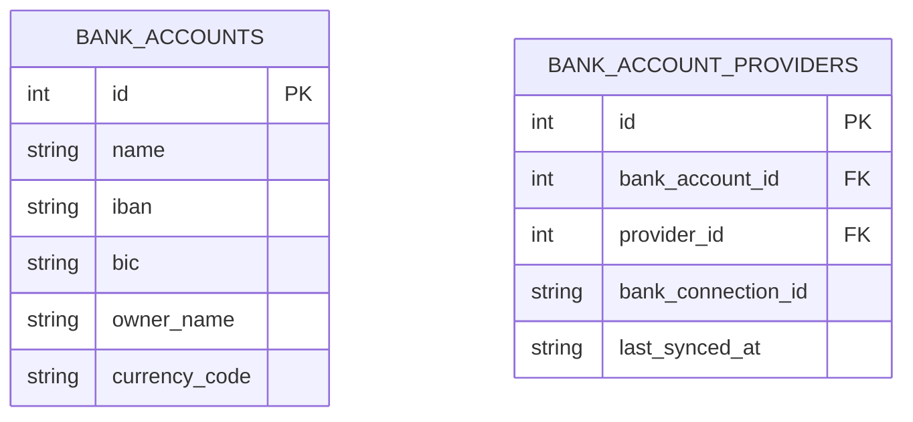
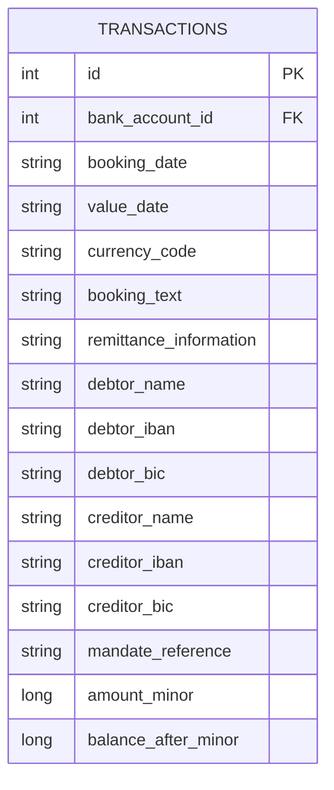

# load live data via gocardless into database

The system shall support fetching live transaction data from bank accounts via the GoCardless Bank Account Data API and importing it into the local database.

## Overview

The GoCardless integration requires a two-phase connection flow before transactions can be synced:

1. **Phase 1** – Create a requisition (a bank link) with GoCardless: the user is redirected to their bank to authorize access.
2. **Phase 2** – After the user authorizes, retrieve the account IDs linked to the requisition and persist them to the database.

Once accounts are linked, transactions can be synced at any time.

## Authentication

GoCardless uses a short-lived access token obtained from API credentials stored per provider.

---

## API Endpoints

### Token

**[POST] /api/v2/token/new/**

Request body:
```json
{
  "secret_id": "string",
  "secret_key": "string"
}
```

Response:
```json
{
  "access": "string",
  "access_expires": 86400,
  "refresh": "string",
  "refresh_expires": 2592000
}
```

**[POST] /api/v2/token/refresh/**

Request body:
```json
{
  "refresh": "string"
}
```

Response:
```json
{
  "access": "string",
  "access_expires": 86400
}
```

---

### Institutions

**[GET] /api/v2/institutions/?country={country}**

Response body: array of bank institution objects.

Each bank object:
```json
{
  "id": "string",
  "name": "string",
  "bic": "string",
  "transaction_total_days": "string",
  "countries": ["string"],
  "logo": "string"
}
```

---

### Requisitions

**[POST] /api/v2/requisitions/**

Request body:
```json
{
  "redirect": "string",
  "institution_id": "string",
  "agreement": "3fa85f64-5717-4562-b3fc-2c963f66afa6",
  "reference": "string",
  "user_language": "string",
  "ssn": "string",
  "account_selection": false,
  "redirect_immediate": false
}
```

Response body:
```json
{
  "id": "3fa85f64-5717-4562-b3fc-2c963f66afa6",
  "created": "2026-03-25T20:09:08.666Z",
  "redirect": "string",
  "status": "CR",
  "institution_id": "string",
  "agreement": "3fa85f64-5717-4562-b3fc-2c963f66afa6",
  "reference": "string",
  "accounts": [],
  "user_language": "string",
  "link": "https://ob.gocardless.com/psd2/start/3fa85f64-5717-4562-b3fc-2c963f66afa6/SANDBOXFINANCE_SFIN0000",
  "ssn": "string",
  "account_selection": false,
  "redirect_immediate": false
}
```

**[GET] /api/v2/requisitions/{id}/**

Response body:
```json
{
  "id": "3fa85f64-5717-4562-b3fc-2c963f66afa6",
  "created": "2026-03-25T20:10:30.954Z",
  "redirect": "string",
  "status": "CR",
  "institution_id": "string",
  "agreement": "3fa85f64-5717-4562-b3fc-2c963f66afa6",
  "reference": "string",
  "accounts": [
    "3fa85f64-5717-4562-b3fc-2c963f66afa6"
  ],
  "user_language": "string",
  "link": "https://ob.gocardless.com/psd2/start/3fa85f64-5717-4562-b3fc-2c963f66afa6/SANDBOXFINANCE_SFIN0000",
  "ssn": "string",
  "account_selection": false,
  "redirect_immediate": false
}
```

**[DELETE] /api/v2/requisitions/{id}/**

Response body:
```json
{
  "summary": "Requisition deleted",
  "detail": "Requisition e9858956-452a-4be9-b988-9ce8bab5e5a7 deleted with all its End User Agreements"
}
```

---

### Account Details

**[GET] /api/v2/accounts/{id}/details/**

Response body:
```json
{
  "account": {
    "resourceId": "string",
    "iban": "string",
    "currency": "string",
    "ownerName": "string",
    "name": "string",
    "product": "string",
    "cashAccountType": "string",
    "additionalAccountData": {
      "secondaryIdentification": "string"
    }
  }
}
```

---

### Account Transactions

**[GET] /api/v2/accounts/{id}/transactions/**

Response body:
```json
{
  "transactions": {
    "booked": [
      {
        "transactionId": "string",
        "debtorName": "string",
        "debtorAccount": {
          "iban": "string"
        },
        "creditorName": "string",
        "creditorAccount": {
          "iban": "string"
        },
        "transactionAmount": {
          "currency": "string",
          "amount": "328.18"
        },
        "bankTransactionCode": "string",
        "bookingDate": "date",
        "bookingDateTime": "datetime",
        "valueDate": "date",
        "valueDateTime": "datetime",
        "remittanceInformationUnstructured": "string"
      },
      {
        "transactionId": "string",
        "transactionAmount": {
          "currency": "string",
          "amount": "947.26"
        },
        "bankTransactionCode": "string",
        "bookingDate": "date",
        "valueDate": "date",
        "remittanceInformationUnstructured": "string"
      }
    ],
    "pending": [
      {
        "transactionAmount": {
          "currency": "string",
          "amount": "99.20"
        },
        "valueDate": "date",
        "remittanceInformationUnstructured": "string"
      }
    ]
  },
  "last_updated": "ISO 8601 timestamp"
}
```

---

## Provider Configuration

GoCardless credentials are stored in the `providers` table:

| Field | Description |
|-------|-------------|
| `title` | `"GoCardless"` |
| `secret_id` | API secret ID from GoCardless portal |
| `secret_key` | API secret key from GoCardless portal |

---

## Target Database Tables

### `bank_accounts` table

GoCardless accounts are stored in the `bank_accounts` table, with provider-specific details stored in `bank_account_providers`:



| Field | GoCardless Source |
|-------|-------------------|
| `bank_accounts.name` | `account.name` |
| `bank_accounts.iban` | `account.iban` |
| `bank_accounts.currency_code` | `account.currency` |
| `bank_account_providers.bank_connection_id` | requisition ID / account ID |

### `transactions` table



---

## Field Mapping: GoCardless Transaction → Database

| GoCardless Field | Database Column | Notes |
|-----------------|-----------------|-------|
| `debtorName` | `debtor_name` | |
| `debtorAccount.iban` | `debtor_iban` | |
| *(not provided)* | `debtor_bic` | |
| `creditorName` | `creditor_name` | |
| `creditorAccount.iban` | `creditor_iban` | |
| *(not provided)* | `creditor_bic` | |
| `transactionAmount.amount` | `amount_minor` | converted to integer minor units |
| `transactionAmount.currency` | `currency_code` | |
| `bookingDate` | `booking_date` | converted to `YYYY-MM-DD` |
| `valueDate` | `value_date` | converted to `YYYY-MM-DD` |
| `remittanceInformationUnstructured` | `remittance_information` | |
| `bankTransactionCode` | `booking_text` | |
| *(internal DB account ID)* | `bank_account_id` | mapped from the `bank_accounts` row |

### Not mapped / ignored

| GoCardless Field | Reason |
|-----------------|--------|
| `transactionId` | not stored in current schema |
| `bookingDateTime` | not stored |
| `valueDateTime` | not stored |
| `pending` transactions | only `booked` transactions are imported |

---

## Date Normalization

GoCardless returns dates as `YYYY-MM-DD`. The `normalize_date` utility converts dates from `DD.MM.YYYY` format to `YYYY-MM-DD` for storage. GoCardless dates are already in ISO format and pass through unchanged.

---

## Connection Flow

### Phase 1 – Create Requisition (Tauri command: `connect_bank_account_phase_1`)

1. Load provider credentials (`secret_id`, `secret_key`) from `providers` table.
2. Authenticate with GoCardless: POST `/api/v2/token/new/` → store `access_token`.
3. Create a requisition: POST `/api/v2/requisitions/` with `redirect` and `institution_id`.
4. Return `BankConnectionInfo { id: requisition_id, link: auth_url }` to the frontend.
5. Frontend redirects user to the authorization URL.

### Phase 2 – Finalize Connection (Tauri command: `connect_bank_account_phase_2`)

1. Re-authenticate with GoCardless.
2. Fetch linked account IDs: GET `/api/v2/requisitions/{requisition_id}/`.
3. For each `account_id` in the response, insert a row into `bank_accounts` table and link it in `bank_account_providers`.

### Disconnect (Tauri command: `disconnect_bank_account`)

1. Authenticate with GoCardless.
2. DELETE `/api/v2/requisitions/{bank_connection_id}/`.

---

## Sync Flow

### Commands

| Tauri Command | Description |
|---------------|-------------|
| `sync_all_accounts` | Syncs transactions for all accounts in the database |
| `sync_provider_accounts` | Syncs transactions for all accounts of a given provider ID |
| `sync_account` | Syncs transactions for a single account by database ID |

### Sync Steps (per account)

1. Load account from `bank_accounts` table.
2. Load provider for the account, instantiate the provider.
3. Fetch booked transactions: GET `/api/v2/accounts/{account_id}/transactions/`.
4. For each booked transaction, check for duplicates before inserting (see deduplication).
5. Insert new transactions into `transactions` table.

---

## Deduplication Strategy

GoCardless `transactionId` is not stored in the database. Deduplication is performed manually by matching on:

- `booking_date`
- `amount_minor`
- `bank_account_id`
- `debtor_iban` (or `IS NULL`)
- `creditor_iban` (or `IS NULL`)
- `remittance_information` (or `IS NULL`)

The manual null-matching is necessary because SQLite UNIQUE constraints do not correctly handle `NULL` values.

---

## Functional Requirements

1. The system shall authenticate with GoCardless using stored `secret_id` and `secret_key`.
2. The system shall support listing available banks by country via GoCardless.
3. The system shall support a two-phase bank account connection flow via requisitions.
4. The system shall persist connected account IDs to the `bank_accounts` table.
5. The system shall support disconnecting a bank account by deleting its requisition.
6. The system shall fetch booked transactions from GoCardless and insert them into the `transactions` table.
7. The system shall skip duplicate transactions during sync using a manual field-matching strategy.
8. The system shall support syncing all accounts, a provider's accounts, or a single account independently.
9. Only `booked` transactions shall be imported; `pending` transactions shall be ignored.
